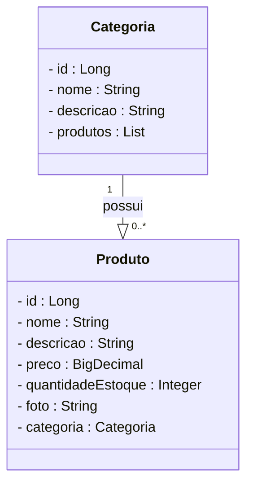

# Projeto Final Bloco 02 - API de Farmácia

<br />

<div align="center">
    
</div>

<br />

<div align="center">
  
  
  
  
  
  
  

</div>

<br />

## 1. Descrição

<br />

A **API de Farmácia** é uma aplicação backend desenvolvida como projeto final do Bloco 02 do Bootcamp da Generation Brasil. O objetivo é permitir o gerenciamento de informações de uma farmácia, como produtos e categorias, através de uma API RESTful. Este projeto foi criado com fins educacionais para aplicar os conhecimentos de desenvolvimento backend com Java e Spring Boot.

Entre os principais recursos que uma API de farmácia pode oferecer, destacam-se:

1.  Criação, leitura, atualização e exclusão (CRUD) de produtos.
2.  Criação, leitura, atualização e exclusão (CRUD) de categorias de produtos.
3.  Associação de produtos a categorias específicas.
4.  (Opcional) Gerenciamento de usuários e autenticação para acesso seguro.
5.  (Opcional) Funcionalidades de busca e filtro de produtos.

<br />

## 2. Sobre esta API

<br />

A API de Farmácia foi desenvolvida utilizando **Java** e o **framework Spring Boot**, seguindo os princípios da Arquitetura REST. Ela oferece endpoints para o gerenciamento dos recursos **Produto** e **Categoria**, permitindo a interação e manipulação desses dados.

<br />

### 2.1. Principais funcionalidades da API:

<br />

1.  **Produtos:**
    * Cadastro de novos produtos (nome, descrição, preço, estoque, etc.).
    * Listagem de todos os produtos.
    * Busca de produto por ID.
    * Atualização dos dados de um produto existente.
    * Exclusão de um produto.
    * (Opcional) Busca de produtos por nome ou outros critérios.
2.  **Categorias:**
    * Cadastro de novas categorias (nome, descrição).
    * Listagem de todas as categorias.
    * Busca de categoria por ID.
    * Atualização dos dados de uma categoria existente.
    * Exclusão de uma categoria.
    * Listagem de produtos por categoria.
3.  **(Opcional) Segurança:**
    * Autenticação de usuários (se implementado).
    * Controle de acesso aos endpoints baseado em perfis de usuário (se implementado).

<br />

## 3. Diagrama de Classes (Exemplo)

<br />

O **Diagrama de Classes** é um modelo visual usado na programação orientada a objetos para representar a estrutura de um sistema. Abaixo, um exemplo simplificado de como as classes `Produto` e `Categoria` poderiam se relacionar. **Adapte este diagrama para refletir a estrutura exata do seu projeto.**

<br />



## 4. Diagrama Entidade-Relacionamento (DER) (Exemplo)

O **DER (Diagrama Entidade-Relacionamento)** do projeto **API de Farmácia** representa de forma visual como os dados estão organizados no banco de dados relacional. Abaixo, um exemplo simplificado. **Adapte este diagrama para refletir a estrutura exata do seu banco de dados.**

```
erDiagram
    tb_categorias ||--o{ tb_produtos : contém
    tb_categorias {
        bigint id PK
        varchar(255) nome
        varchar(255) descricao
    }
    tb_produtos {
        bigint id PK
        varchar(255) nome
        varchar(1000) descricao
        decimal(10,2) preco
        int quantidade_estoque
        varchar(5000) foto
        bigint categoria_id FK
    }

```

## 5. Tecnologias Utilizadas

Item

Descrição

**Linguagem de programação**

Java

**Framework**

Spring Boot

↳ **Web**

Spring Web (para APIs RESTful)

↳ **Dados**

Spring Data JPA (para persistência)

↳ **Segurança**

Spring Security (se aplicável para autenticação/autorização)

↳ **Validação**

Bean Validation (Hibernate Validator)

**ORM**

JPA + Hibernate

**Build Tool**

Maven

**Banco de dados Relacional**

MySQL (ou H2 Database - verifique `application.properties`)

**Containerização**

Docker (Dockerfile presente, opcional para execução)

**Documentação da API**

Swagger/OpenAPI (SpringDoc)

**Servidor Embarcado**

Tomcat (padrão do Spring Boot)

**Testes (se aplicável)**

JUnit, Mockito (para testes unitários/integração)

## 6. Requisitos

Para executar o projeto localmente, você precisará ter instalado:

-   [Java JDK 17+](https://www.oracle.com/java/technologies/javase/jdk17-archive-downloads.html "null") ou superior.
    
-   [Maven](https://maven.apache.org/download.cgi "null") 3.6 ou superior.
    
-   [Git](https://git-scm.com/downloads "null").
    
-   Um Sistema de Gerenciamento de Banco de Dados (SGBD) como o [MySQL](https://dev.mysql.com/downloads/ "null") (se não estiver usando o H2 em memória).
    
-   (Opcional) [Docker](https://www.docker.com/get-started "null") instalado, se desejar rodar via container.
    
-   (Opcional) Um cliente API como [Postman](https://www.postman.com/downloads/ "null") ou [Insomnia](https://insomnia.rest/download "null") para testar os endpoints.
    
-   (Opcional) Uma IDE como [Spring Tool Suite (STS)](https://spring.io/tools "null"), IntelliJ IDEA ou VSCode com extensões Java/Spring.
    

## 7. Como Executar o Projeto

Siga os passos abaixo para executar o projeto em seu ambiente local:

### 7.1. Configuração Inicial

1.  **Clone o repositório:**
    
    ```
    git clone [https://github.com/Brunogodoy2911/projeto_final_bloco_02.git](https://github.com/Brunogodoy2911/projeto_final_bloco_02.git)
    cd projeto_final_bloco_02
    
    ```
    
2.  **Configure o Banco de Dados:**
    
    -   Abra o arquivo `src/main/resources/application.properties`.
        
    -   Ajuste as propriedades do banco de dados (`spring.datasource.url`, `spring.datasource.username`, `spring.datasource.password`, `spring.jpa.hibernate.ddl-auto`) de acordo com seu ambiente MySQL.
        
        -   Exemplo para MySQL:
            
            ```
            spring.datasource.url=jdbc:mysql://localhost:3306/db_farmacia?createDatabaseIfNotExist=true&serverTimezone=UTC&useSSL=false
            spring.datasource.username=root
            spring.datasource.password=your_password
            spring.jpa.hibernate.ddl-auto=update
            spring.jpa.show-sql=true # Opcional: para ver os comandos SQL gerados
            
            ```
            
        -   Se estiver usando o H2 Database em memória para desenvolvimento, a configuração pode ser mais simples ou já estar definida para tal (verifique o perfil `dev` ou `test` se houver).
            
    -   Certifique-se de que o servidor do banco de dados (MySQL, por exemplo) esteja em execução. O schema (`db_farmacia`) geralmente é criado automaticamente se `createDatabaseIfNotExist=true` estiver na URL de conexão do MySQL e `spring.jpa.hibernate.ddl-auto` estiver como `update` ou `create`.
        

### 7.2. Executando com Maven

1.  Abra um terminal ou prompt de comando na raiz do projeto.
    
2.  Compile e execute a aplicação usando o Maven Wrapper:
    
    -   No Windows:
        
        ```
        ./mvnw spring-boot:run
        
        ```
        
    -   No Linux/macOS:
        
        ```
        ./mvnw spring-boot:run
        
        ```
        
    -   Alternativamente, se você tem o Maven instalado globalmente:
        
        ```
        mvn spring-boot:run
        
        ```
        
3.  A aplicação estará disponível, por padrão, em `http://localhost:8080`. Verifique o console para qualquer mensagem de erro ou confirmação.
    

### 7.3. (Opcional) Executando com Docker

1.  Certifique-se de que o Docker Desktop está em execução.
    
2.  Construa a imagem Docker (a partir da raiz do projeto, onde está o `Dockerfile`):
    
    ```
    docker build -t farmacia-api .
    
    ```
    
3.  Execute o container:
    
    ```
    docker run -p 8080:8080 farmacia-api
    
    ```
    
    -   **Nota:** A configuração padrão do `Dockerfile` pode não incluir a configuração do banco de dados externo. Você pode precisar:
        
        -   Passar variáveis de ambiente para o container (`-e SPRING_DATASOURCE_URL=...`).
            
        -   Garantir que o container possa acessar o seu host de banco de dados (ex: usando `host.docker.internal` na URL de conexão JDBC em vez de `localhost`).
            
        -   Ou usar Docker Compose para orquestrar a API e um container de banco de dados.
            

> [!TIP]
> 
> Após iniciar a aplicação, a documentação interativa da API (Swagger UI) pode ser acessada em seu navegador através do endereço: **`http://localhost:8080/swagger-ui/index.html`**
> 
> Se você realizou o deploy da aplicação (ex: no Render, como o link `https://farmaciaapi-eupq.onrender.com/swagger-ui/index.html` sugere), utilize o endereço fornecido pelo serviço de deploy.

## 8. Contribuição

Este repositório é parte de um projeto educacional, mas contribuições são sempre bem-vindas! Caso tenha sugestões, correções ou melhorias, fique à vontade para:

-   Criar uma **issue** para discutir a mudança que você gostaria de fazer.
    
-   Enviar um **pull request** com suas melhorias.
    
-   Compartilhar com colegas que estejam aprendendo Java e Spring Boot!
    

## 9. Contato

Desenvolvido por **Bruno Godoy**

-   **GitHub:**  [Brunogodoy2911](https://github.com/Brunogodoy2911 "null")
    
-   **LinkedIn:** [brunogodoydev](https://www.linkedin.com/in/brunogodoydev/).
    

Para dúvidas, sugestões ou colaborações, entre em contato via GitHub ou abra uma issue no repositório!
